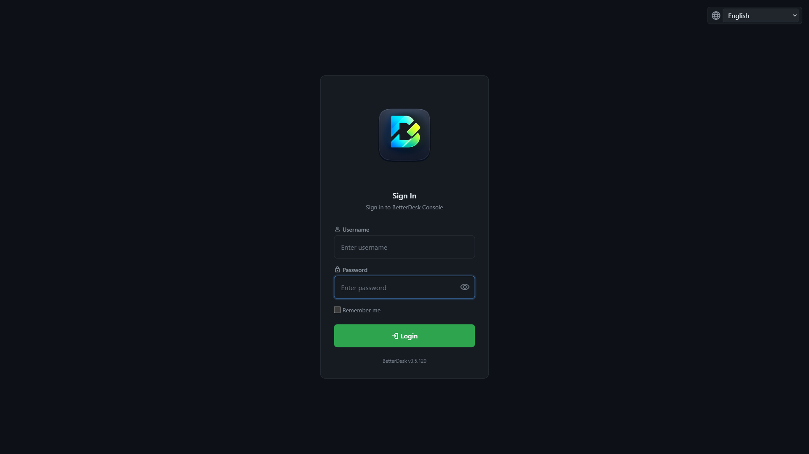
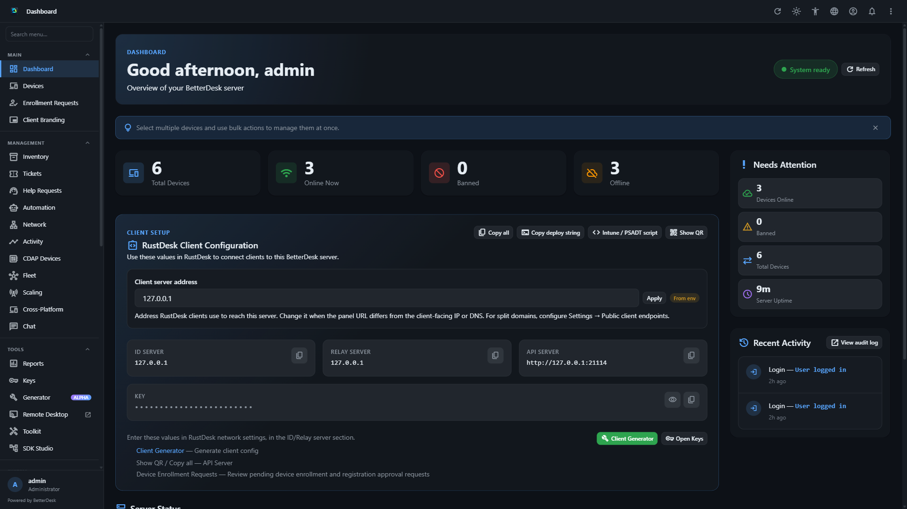
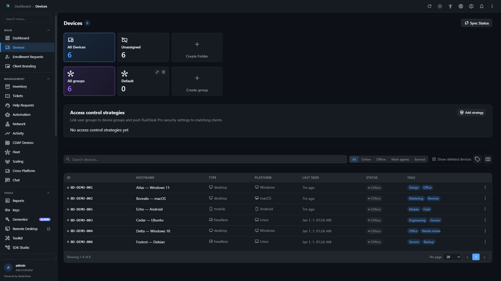
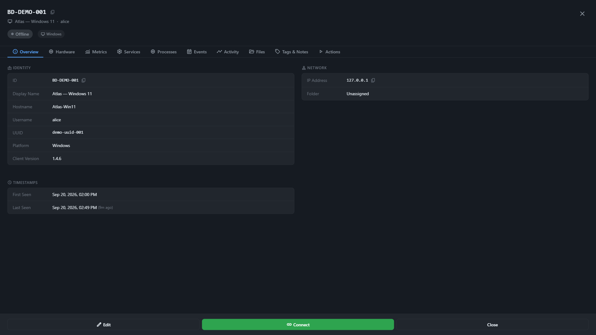
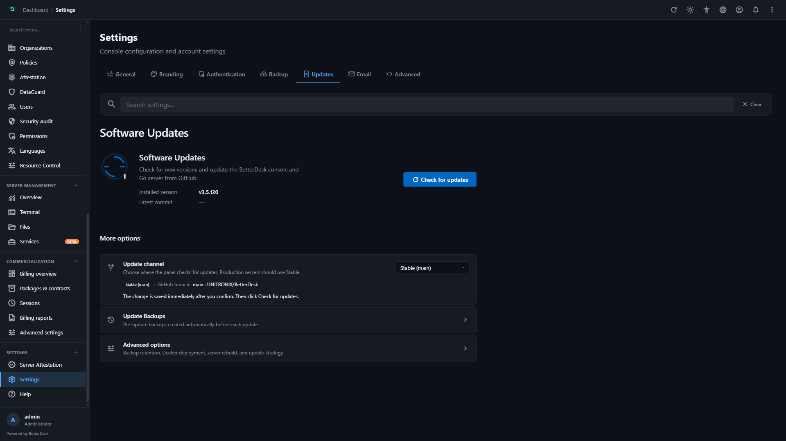

# BetterDesk

<div align="center">


<br><br>


[](https://github.com/sponsors/UNITRONIX)
[](https://buymeacoffee.com/unitronix)
[](https://discord.gg/MPp9hyyG97)

**Self-hosted RustDesk-compatible server in Go** (one binary instead of hbbs + hbbr) **plus a Node.js web console.**

[Wiki](https://github.com/UNITRONIX/BetterDesk/wiki) · [Privacy](PRIVACY.md) · [Sponsors](SPONSORS.md) · [Changelog](CHANGELOG.md)

<br>

### Honorary supporter

<a href="https://insolve.pl">
  
</a>

[INSOLVE](https://insolve.pl) — see [SPONSORS.md](SPONSORS.md) for everyone who backs the project.

</div>

---

> **Alpha desktop apps:** Tauri MGMT / Agent clients are not for production. Use the **web console** and a normal **RustDesk** client. Details: [Alpha notice](https://github.com/UNITRONIX/BetterDesk/wiki/Alpha-Software-Notice).

Your data stays on **your** server. The project does not run vendor analytics — [PRIVACY.md](PRIVACY.md).

> **AI-assisted development:** BetterDesk is created and maintained with the assistance of artificial intelligence tools.

---

## Quick start

### Linux

```bash
git clone https://github.com/UNITRONIX/BetterDesk.git
cd BetterDesk
sudo ./betterdesk.sh
```

Choose **1** for a new install, or `sudo ./betterdesk.sh --auto`.

### Docker

```bash
curl -fsSL https://raw.githubusercontent.com/UNITRONIX/BetterDesk/main/docker-compose.quick.yml -o docker-compose.yml
docker compose up -d
```

Open **http://your-server:5000**.

### Windows

Run `betterdesk.ps1` as Administrator — see the [Installation wiki](https://github.com/UNITRONIX/BetterDesk/wiki/Installation).

---

## Documentation

| Topic | Where |
|-------|--------|
| Full guides | **[GitHub Wiki](https://github.com/UNITRONIX/BetterDesk/wiki)** |
| Install / Docker / clients | [Installation](https://github.com/UNITRONIX/BetterDesk/wiki/Installation) · [Docker](https://github.com/UNITRONIX/BetterDesk/wiki/Docker) · [Client setup](https://github.com/UNITRONIX/BetterDesk/wiki/Client-Setup) |
| Config, TLS, updates | [Configuration](https://github.com/UNITRONIX/BetterDesk/wiki/Configuration) · [TLS](https://github.com/UNITRONIX/BetterDesk/wiki/TLS-SSL) · [Panel updates](https://github.com/UNITRONIX/BetterDesk/wiki/Panel-Updates) |
| Monitoring / WoL | [Monitoring](https://github.com/UNITRONIX/BetterDesk/wiki/Monitoring) · [Unattended & WoL](https://github.com/UNITRONIX/BetterDesk/wiki/Unattended-and-WoL) |
| Help | [Troubleshooting](https://github.com/UNITRONIX/BetterDesk/wiki/Troubleshooting) · [FAQ](https://github.com/UNITRONIX/BetterDesk/wiki/FAQ) |
| Privacy / license | [PRIVACY.md](PRIVACY.md) · [Licensing](https://github.com/UNITRONIX/BetterDesk/wiki/Licensing) |
| Developers | [docs/](docs/) · [API](https://github.com/UNITRONIX/BetterDesk/wiki/API-Reference) · [CDAP](https://github.com/UNITRONIX/BetterDesk/wiki/CDAP) · [Contributing](docs/development/CONTRIBUTING.md) |

Wiki source in-repo: [`docs/wiki/`](docs/wiki/) (sync with `scripts/sync-wiki.ps1` / `.sh`).

---

## Web console preview

The BetterDesk web console uses the UX 3.5 interface. These preview images show the dark theme in English with fictional device data:

<table>
  <tr>
    <td></td>
    <td></td>
  </tr>
  <tr>
    <td align="center">Login</td>
    <td align="center">Dashboard</td>
  </tr>
  <tr>
    <td></td>
    <td></td>
  </tr>
  <tr>
    <td align="center">Devices</td>
    <td align="center">Device details</td>
  </tr>
  <tr>
    <td colspan="2"></td>
  </tr>
  <tr>
    <td colspan="2" align="center">Settings → Updates</td>
  </tr>
</table>

See the [Web Console wiki page](https://github.com/UNITRONIX/BetterDesk/wiki/Web-Console) for the full visual tour and panel capabilities.

---

## Ports (short)

| Port | Role |
|------|------|
| 21116 TCP+UDP | Signal |
| 21117 TCP | Relay |
| 21121 | RustDesk Client API (Go; optional Node proxy) |
| 21114 | Admin REST (usually localhost) |
| 5000 | Web console |
| 21122 | CDAP (optional) |

---

## Contributing

Diagnostics → [issue](https://github.com/UNITRONIX/BetterDesk/issues) → fork / PR. See [docs/development/CONTRIBUTING.md](docs/development/CONTRIBUTING.md).

---

## License

[AGPL-3.0](LICENSE). Optional Commercial Grant for eligible sponsors — [docs/COMMERCIAL-GRANT.md](docs/COMMERCIAL-GRANT.md).

---

## Support

- [Discord](https://discord.gg/MPp9hyyG97)
- [GitHub Issues](https://github.com/UNITRONIX/BetterDesk/issues)
- [Discussions](https://github.com/UNITRONIX/BetterDesk/discussions)
